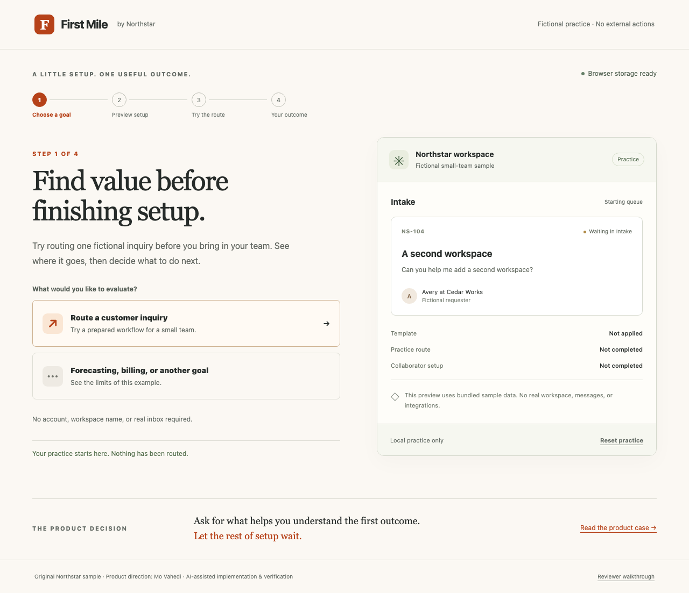

# First Mile

**Try one useful workflow before finishing setup.** An original Northstar product-management prototype for a first-time B2B workspace administrator.

Choose a goal, preview a small-team template, deliberately route one bundled fictional inquiry to Customer care, defer optional collaborator simulation, and return to the confirmed outcome. Warm white, ink, and tangerine connect the guided journey to its workspace preview.

**Current stage:** bounded release candidate, September 30, 2026. Local software verification is complete; public deployment verification is in progress. [Interactive demo](https://mvahedi2020.github.io/First-Mile/) · [Public source](https://github.com/mvahedi2020/First-Mile). The [September 28 brief](docs/Product_Brief.md) is preserved historical framing and describes the earlier pre-implementation stage.



## Product evidence

| Reviewer question | Evidence |
|---|---|
| Which decisions precede first value, and why? | [Case study](docs/product/Case_Study.md), [requirements](docs/product/PRD.md) |
| What happens at confirmation, cancellation and return? | [Sample contract](docs/product/Sample_Contract.md) |
| How can I reproduce the primary and recovery journey? | [Walkthrough](docs/product/Sample_Walkthrough.md) |
| What is verified and what is still uncertain? | [Validation](docs/product/Validation.md), [decisions and risks](docs/product/Decisions_and_Risks.md) |

The one supported goal is inquiry routing. Unsupported goals receive an explicit scope explanation. Template and route previews change no confirmed state; a deliberate confirmation is required. Deferred collaborators are different from completed simulation. Return cannot replay the completed route. Bounded route undo retains the template and clears dependent optional state; reset clears everything and has no undo.

All records and people are fictional. No sign-in, invitation, message, real routing, production integration, external API, AI inference, or tracking is performed. The application needs no runtime credentials or external service. Compatible progress is saved only in this browser. Invalid data requires confirmed recovery; unavailable storage is explained as temporary practice. Cross-tab state replaces confirmed progress; no transactional multiuser system is claimed.

## Run and verify

Node 22.12+ is required (CI uses Node 24).

```sh
npm ci
npm run dev
# http://127.0.0.1:4186/First-Mile/
npm run lint
npm run typecheck
npm test
npm run build
npx playwright install chromium
npm run test:e2e
```

Browser verification starts its own production preview on port 4186; stop any existing dev/preview process before running it. `npm run preview` serves built output manually. CI verifies lint, types, domain tests, production build, dependency audit and production browser flows before Pages upload/deployment. Production builds add CSP and no-referrer metadata and include the product documents. Generated output, environment files, browser traces and runtime folders are excluded from Git. There is no supported runtime environment-variable configuration.

## Product ownership

Mo Vahedi owns product direction, prioritization, scope, experience requirements and evaluation decisions. AI assists implementation and software verification. This portfolio demonstrates product judgment and does not claim Mo manually wrote application code. Software checks do not establish human comprehension, adoption, customer research, commercial outcomes, or Mo's personal review. Proposed human evaluation and investment rules are documented separately from actual checks.
